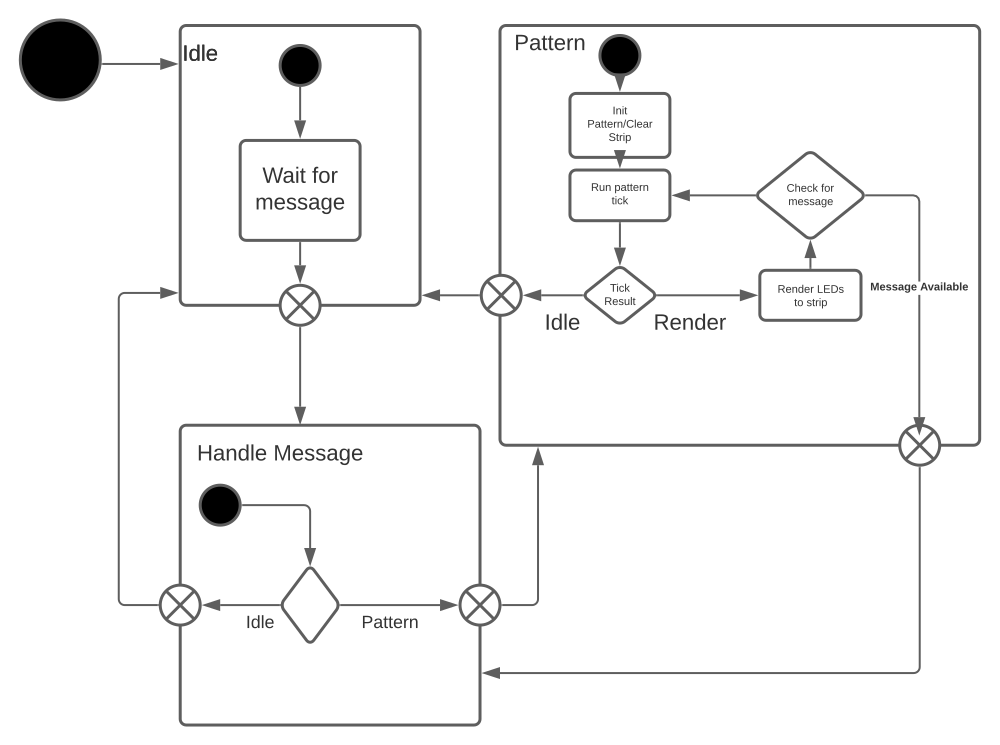

# Rust Backend
The backend is a rocket server which serves the frontend, manages a json api and runs a thread which is used to control the led strips.

The thread which runs the led strips is a state machine which receives JSON messages over channels from the main thread which control state transition. Below is a diagram which shows how this state machine works.

